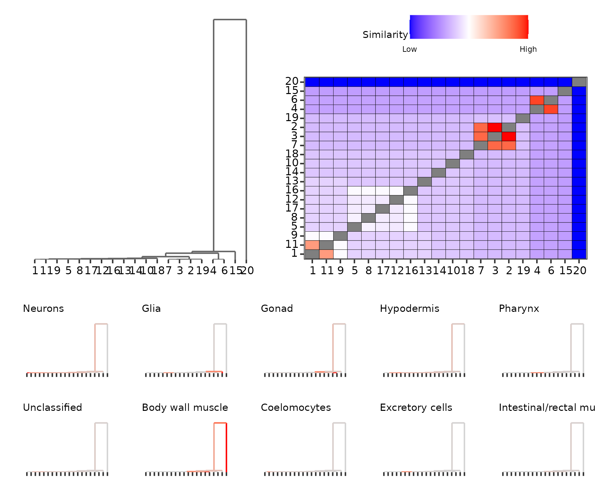
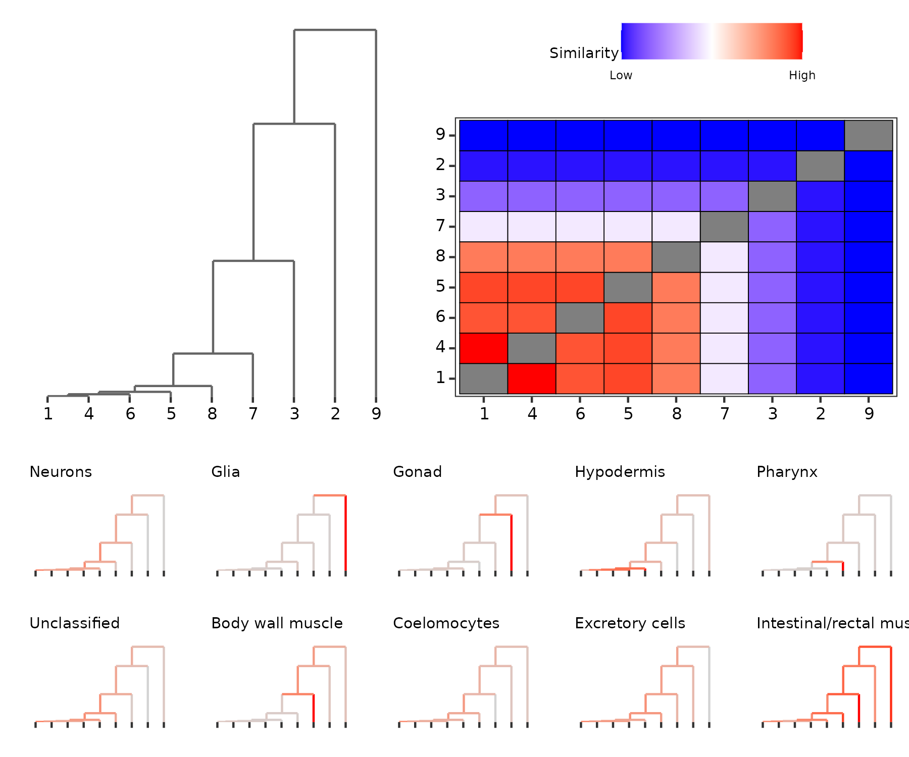
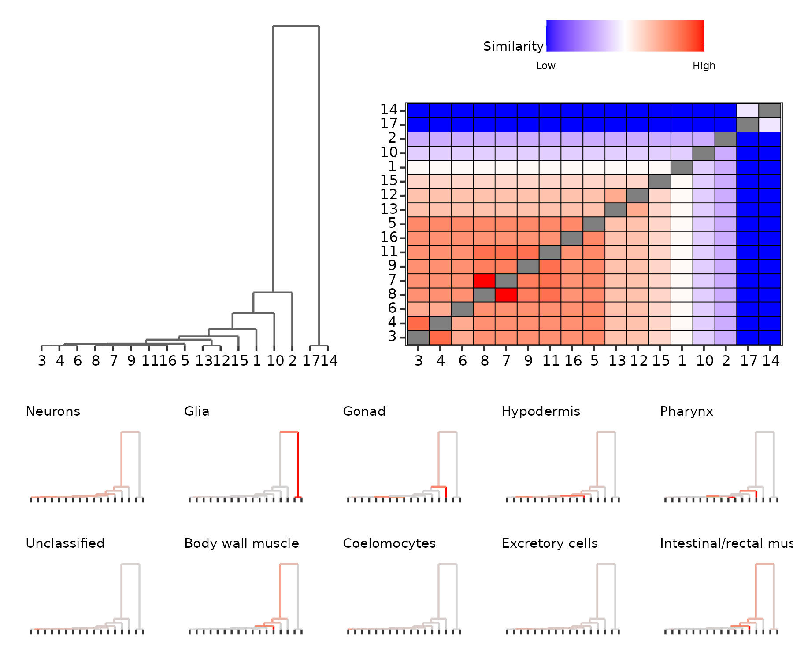

# Larval *C. elegans* Cells

Load the necessary packages

```
library(monocle3)
library(PHM)
library(mclust)

library(stringr)
library(ggplot2)
library(dplyr)
library(tidyr)
library(ggpubr)
library(PCAtools)
```

Load the data (downloaded from the [monocle3](https://cole-trapnell-lab.github.io/monocle3/docs/clustering/) documentation) and filter out the "Failed QC" cells
```
expression_matrix <- readRDS(url("https://depts.washington.edu:/trapnell-lab/software/monocle3/celegans/data/cao_l2_expression.rds"))
cell_metadata <- readRDS(url("https://depts.washington.edu:/trapnell-lab/software/monocle3/celegans/data/cao_l2_colData.rds"))
gene_annotation <- readRDS(url("https://depts.washington.edu:/trapnell-lab/software/monocle3/celegans/data/cao_l2_rowData.rds"))

toDrop <- which(cell_metadata$cao_cell_type %in% c(NA, "Failed QC"))
cell_metadata <- cell_metadata[-toDrop, ]
expression_matrix <- expression_matrix[, -toDrop]
TISSUE_LABELS <- cell_metadata$cao_tissue
TISSUE_LABELS[is.na(TISSUE_LABELS)] <- "Unclassified"
CELL_LABELS <- cell_metadata$cao_cell_type
```

Determine the elbow point based on the first 100 components of the aligned embedding (columns need to be reordered since alignment results in non-decreasing variances). Note that the monocle3 object must be initialized twice so that the Leiden clustering can be done on the reduced dimension embedding.

```
## Original 
cds <- new_cell_data_set(expression_matrix,
                           cell_metadata = cell_metadata,
                           gene_metadata = gene_annotation)
  cds <- preprocess_cds(cds, num_dim = 200)
  cds <- align_cds(cds, alignment_group = "plate")
  cds <- reduce_dimension(cds)

embed <- reducedDims(cds)$Aligned
embed_var <- diag(var(embed))
embed_order <- order(embed_var, decreasing = T)
embed <- embed[, embed_order]
embed_var <- embed_var[embed_order]
elbow <- PCAtools::findElbowPoint(embed_var[1:100]) ## 10 PCs

## Clustering based on the elbow point
cds_elbow <- cds
reducedDims(cds_elbow)$Aligned <- embed[, 1:elbow]
reducedDims(cds_elbow)$UMAP <- NULL
cds_elbow <- reduce_dimension(cds_elbow)
cds_elbow <- cluster_cells(cds_elbow)
```

Estimate the parameters and run the PHM procedure for the Leiden algorithm
```
DATA <- embed[, 1:elbow]
set.seed(20250108)
leiden_part <- clusters(cds_elbow)
leiden_params <- constructPmcParamsWeightedPartition(leiden_params, 
                                                      DATA,
                                                      G=1:20)

leiden_phm <- PHM(paramsList=leiden_params, 
                  data=DATA,
                  mcSamples=1e6,
                  batchSize=1e5)
```


Visualizations for Leiden algorithm

```
## Leiden PHM results
leiden_matrix <- plotPHMMatrix(leiden_phm, 
                             displayAxis = "label",
                             displayAxisSize = 8,
                             fillScale = "pmcdist",
                             legendPosition = "top") +
  plot_theme

leiden_dendro <- plotPHMDendrogram(phm, 
                                 displayAxis="label",
                                 displayAxisSize = 8,
                                 # scaleHeights = "unscaled",
                                 suppressLabels = T,
                                 mergeLabelsSize = 3) +
  plot_theme

## The dendrograms by tissue type
leiden_tissue_dendrograms <- generate_tissue_dendrograms(leiden_phm)

ggarrange(
  ggarrange(leiden_dendro, leiden_matrix, 
            nrow=1, widths=c(4, 5)),
  ggarrange(plotlist=leiden_tissue_dendrograms, ncol=5, nrow=2),
  heights=c(3, 2),
  nrow=2
)
```

<center>

</center>

Repeat the analysis using hierarchical clustering. Note that this produces singleton clusters, which are ignored.

```
worm_dist <- dist(DATA, "euc")
hcl <- hclust(worm_dist, method="ward.D2")

res_hcl <- lapply(2:60, function(K) {
  hcl_part <- cutree(hcl, K)
  sil <- silhouette_of_clusters(DATA, hcl_part)$silhouette_global_average
  print(paste(K, round(sil, 4)))
  list(K=K,
       clust=hcl_part,
       sil=sil)
})

hcl_idx <- which.max(sapply(res_hcl, function(x) x$sil))
hcl_partition <- res_hcl[[hcl_idx]]$clust
hcl_k <- res_hcl[[hcl_idx]]$K

## We do not handle singleton clusters
hcl_invalid <- which(hcl_partition %in% names(which(table(hcl_partition) == 1)))

## Parameter estimates and PHM
set.seed(20250108)
hcl_params <- constructPmcParamsWeightedPartition(hcl_partition[-hcl_invalid], 
                                                  DATA[-hcl_invalid, ],
                                                  G=1:20)

hcl_phm <- PHM(paramsList=hcl_params, 
               data=DATA[-hcl_invalid, ],
               mcSamples=1e6,
               batchSize=1e5)

hcl_heatmap <- plotPHMMatrix(hcl_phm, 
                            displayAxis = "label",
                            displayAxisSize = 8,
                            fillScale = "pmcdist",
                            legendPosition = "top") +
  plot_theme

hcl_dendrogram <- plotPHMDendrogram(hcl_phm, 
                                   displayAxis="label",
                                   displayAxisSize = 8,
                                   scaleHeights = "unscaled",
                                   suppressLabels = T,
                                   mergeLabelsSize = 3) +
  plot_theme
hcl_tissue_dendrograms <- generate_tissue_dendrograms(hcl_phm)

ggarrange(
  ggarrange(hcl_dendrogram, hcl_heatmap, 
            nrow=1, widths=c(4, 5)),
  ggarrange(plotlist=hcl_tissue_dendrograms, ncol=5, nrow=2),
  heights=c(3, 2),
  nrow=2
)
```

<center>

</center>

Repeat the analysis using DensityCut.

```
dc <- DensityCut(DATA, show.plot=F)
dc_partition <- match(dc$cluster, sort(unique(dc$cluster)))

set.seed(20250108)
dc_params <- constructPmcParamsWeightedPartition(dc_partition, 
                                                 DATA,
                                                 G=1:20)
dc_phm <- PHM(paramsList=dc_params, 
              data=DATA,
              mcSamples=1e6,
              batchSize=1e5)

dc_heatmap <- plotPHMMatrix(dc_phm, 
                               displayAxis = "label",
                               displayAxisSize = 8,
                               fillScale = "pmcdist",
                               legendPosition = "top") +
  plot_theme

dc_dendrogram <- plotPHMDendrogram(dc_phm, 
                                 displayAxis="label",
                                 displayAxisSize = 8,
                                 scaleHeights = "unscaled",
                                 suppressLabels = T,
                                 mergeLabelsSize = 3) +
  plot_theme
dc_tissue_dendrograms <- generate_tissue_dendrograms(dc_phm)

ggarrange(
  ggarrange(dc_dendrogram, dc_heatmap, 
            nrow=1, widths=c(4, 5)),
  ggarrange(plotlist=dc_tissue_dendrograms, ncol=5, nrow=2),
  heights=c(3, 2),
  nrow=2
)
```

<center>

</center>


Helper functions

```
### Vis helpers
plot_theme <- theme(text = element_text(size=7),
                    title = element_text(size=7))

generate_tissue_dendrograms <- function(phm, scale_heights="unscaled") {
  part <- phm[[length(phm)]]$labels
  part_order <- sapply(phm[[length(phm)]]$params, function(x) x$class)
  tissue_order <- data.frame(tissue=TISSUE_LABELS, cell=cell_metadata$cao_cell_type) %>%
    group_by(tissue) %>%
    summarize(n=length(unique(cell))) %>%
    arrange(-n) %>%
    pull(tissue)

  lapply(
    tissue_order, function(lab) {
      group_prob <- sapply(part_order, function(idx) mean(str_detect(TISSUE_LABELS[which(part == idx)], lab)))
      
      plotPHMDendrogram(phm, 
                        displayAxis="none",
                        suppressLabels = T,
                        scaleHeights = scale_heights,
                        groupColorMax = "red",
                        groupProbs = group_prob) +
        ggtitle(lab) + theme(text=element_text(size=6))
    }
  )
}
```