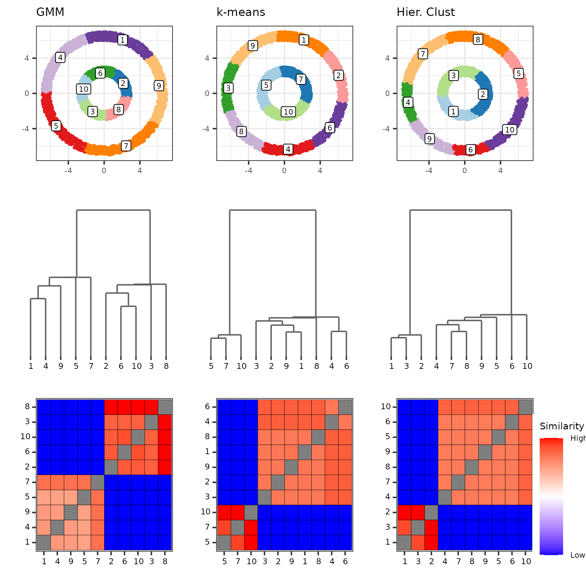

# Double Ring

Load the packages and call the data

```
library(PHM)
library(mclust)
library(ClusterR)
library(ggpubr)
library(dplyr)
library(tidyr)
library(ggplot2)

data("double_ring", package="PHM")
```

Test models with 2 clusters

```
dist_data <- dist(double_ring, method="euclidean")
hcl <- hclust(dist_data, method="ward.D2")
hcl_2 <- cutree(hcl, 2)
gmm_2 <- Mclust(double_ring, G=2)
kcl_2 <- KMeans_rcpp(double_ring, 2, num_init = 5)

plt_hcl_2 <- data_plot(double_ring, hcl_2, "Set1") + ggtitle("Hier. Clust")
plt_gmm_2 <- data_plot(double_ring, gmm_2$classification, "Set1") + ggtitle("GMM")
plt_kcl_2 <- data_plot(double_ring, kcl_2$clusters, "Set1") + ggtitle("k-means")
```

<center>

</center>

Fit the models to the data

```
gmm <- Mclust(double_ring, G=1:10)

## Silhouette score
cluster_silhouettes <- sapply(2:10, function(k) {
  hcl_labels <- cutree(hcl, k)
  kcl_labels <- KMeans_rcpp(double_ring, k, num_init = 5)$clusters
  c(K=k,
    sil_hcl=colMeans(silhouette(hcl_labels, dist_data))["sil_width"],
    sil_kcl=colMeans(silhouette(kcl_labels, dist_data))["sil_width"])
})

## Hier Clustering
hcl_K <- cluster_silhouettes[1, which.max(cluster_silhouettes[2, ])]
hcl_labels <- cutree(hcl, hcl_K)

## k-means
kcl_K <- cluster_silhouettes[1, which.max(cluster_silhouettes[nrow(cluster_silhouettes), ])]
kcl <- ClusterR::KMeans_rcpp(double_ring, kcl_K, num_init = 5)
kcl_labels <- kcl$clusters
```

Run the PHM algorithm

```
gmm_params <- constructPmcParamsMclust(gmm)
phm_gmm <- PHM(paramsList=gmm_params, 
               data=double_ring,
               batchSize=1e5)

kcl_params <- constructPmcParamsWeightedPartition(
  kcl_labels,
  data
)
phm_kcl <- PHM(paramsList=kcl_params, 
               data=double_ring,
               batchSize=1e5)

hcl_params <- constructPmcParamsWeightedPartition(
  hcl_labels,
  data
)
phm_hcl <- PHM(paramsList=hcl_params, 
               batchSize=1e5,
               data=double_ring)
```

Visualize the results

```
htmp_gmm <- plotPHMMatrix(phm_gmm,
                          displayAxis = "label",
                          fillScale="pmcdist",
                          displayAxisSize = 6) + plot_theme
htmp_kcl <- plotPHMMatrix(phm_kcl,
                          displayAxis = "label",
                          fillScale="pmcdist",
                          displayAxisSize = 6) + plot_theme
htmp_hcl <- plotPHMMatrix(phm_hcl,
                          displayAxis = "label",
                          fillScale="pmcdist",
                          displayAxisSize = 6) + plot_theme

dendro_gmm <- plotPHMDendrogram(phm_gmm, 
                                scaleHeights = "log10", 
                                displayAxis = "label",
                                displayAxisSize = 6, 
                                suppressLabels = T) + plot_theme
dendro_kcl <- plotPHMDendrogram(phm_kcl, 
                                scaleHeights = "log10", 
                                displayAxis = "label",
                                displayAxisSize = 6,
                                suppressLabels = T) + plot_theme
dendro_hcl <- plotPHMDendrogram(phm_hcl, 
                                scaleHeights = "log10", 
                                displayAxis = "label",
                                displayAxisSize = 6,
                                suppressLabels = T) + plot_theme


### Cluster solutions
dat_gmm <- data_plot(double_ring, gmm$classification) + ggtitle("GMM")
dat_kcl <- data_plot(double_ring, kcl_labels) + ggtitle("k-means")
dat_hcl <- data_plot(double_ring, hcl_labels) + ggtitle("Hier. Clust")

ggarrange(
  dat_gmm,    dat_kcl,    dat_hcl,    NULL, #dat_louvain,
  dendro_gmm, dendro_kcl, dendro_hcl, NULL, #dendro_louvain,
  htmp_gmm,   htmp_kcl,   htmp_hcl,   get_legend(htmp_gmm, "right"),
  widths=c(4, 4, 4, 1),
  nrow=3, ncol=4
)
```

<center>

</center>


Helper functions

```
plot_theme <- theme(text = element_text(size=7),
                    title = element_text(size=7))

data_plot <- function(data, labels, pallette="Paired", colors=NULL, suppress_labels=F) {
  labs <- unique(labels)
  if (is.null(colors)) colors <- RColorBrewer::brewer.pal(length(labs), pallette)
  names(colors) <- labs
  
  plot_df <- cbind(data.frame(data), 
                   color=factor(labels,
                                levels=labs,
                                ordered=T))
  
  out <- ggplot(plot_df, 
         aes(x=X1, y=X2,
             color=color)) +
    geom_point(size=0.5) +
    scale_color_manual(values=colors) +
    theme_bw() +
    theme(legend.position = "none") +
    xlab("") + ylab("") + plot_theme
  
  if (!suppress_labels)
    out <- out + 
      geom_label(aes(label=color, color=NULL), 
                 data=plot_df %>% 
                   group_by(color) %>% 
                   summarize(X1=median(X1), X2=median(X2)),
                 size=2)
  
  return(out)
}
```