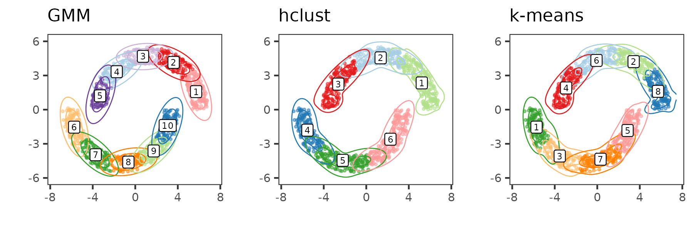
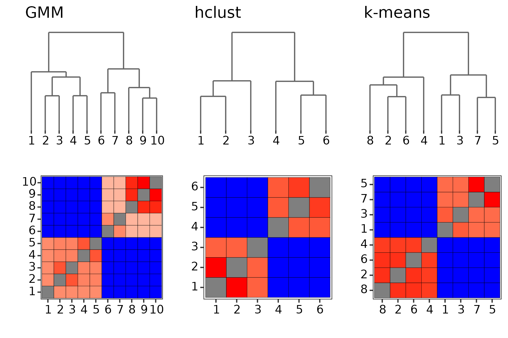

# Half Moons

Load the necessary packages and call the data

```
library(PHM)
library(mclust)
library(fastcluster)
library(ClusterR)
library(ggpubr)
library(RColorBrewer)

rm(list=ls())

data("moons", package="PHM")
```

Fitting models

```
## Fit GMM and run hierarchical clustering
mcl <- Mclust(moons, G=1:15)
hcl <- hclust(dist(moons), method = "ward.D2")

## Silhouette score for hierarchical clustering and k-means
hkcl_silhouettes <- lapply(2:15, function(K) {
  cat("Running for K =", K, "\n")
  hcl_part <- cutree(hcl, K)
  kcl_part <- KMeans_rcpp(moons, K, num_init = 5)$clusters
  
  hcl_sil <- silhouette_of_clusters(moons, hcl_part)
  kcl_sil <- silhouette_of_clusters(moons, kcl_part)

  list(
    K=K,
    hcl_part=hcl_part,
    kcl_part=kcl_part,
    hcl_sil=hcl_sil$silhouette_global_average,
    kcl_sil=kcl_sil$silhouette_global_average
  )
})

## Determine the optimal value of K for k-means and hierarchical clustering
hcl_max_sil <- which.max(sapply(hkcl_silhouettes, function(x) x$hcl_sil))
kcl_max_sil <- which.max(sapply(hkcl_silhouettes, function(x) x$kcl_sil))

hcl_K <- hkcl_silhouettes[[hcl_max_sil]]$K
kcl_K <- hkcl_silhouettes[[kcl_max_sil]]$K

## Extract the partitions
mcl_part <- mcl$classification
hcl_part <- hkcl_silhouettes[[hcl_max_sil]]$hcl_part
kcl_part <- hkcl_silhouettes[[kcl_max_sil]]$kcl_part
```

Comparing the partitions via ARI, the clustering solutions generally don't agree

```
|       | GMM| hclust| kmeans|
|:------|---:|------:|------:|
|kmeans |  --|     --|     --|
|hclust |  --|     --|  0.612|
|GMM    |  --|  0.578|  0.739|
```

Parameter estimation and running PHM

```
## Parameter estimation
mcl_params <- constructPmcParamsMclust(mcl)
hcl_params <- constructPmcParamsWeightedPartition(hcl_part, data=moons)
kcl_params <- constructPmcParamsWeightedPartition(kcl_part, data=moons)
```

<center>

</center>


PHM and PHM results

```
## Run PHM
mcl_phm <- PHM(paramsList=mcl_params, data=moons, mc=F)
hcl_phm <- PHM(paramsList=hcl_params, data=moons, partition=hcl_part, mc=F)
kcl_phm <- PHM(paramsList=kcl_params, data=moons, partition=kcl_part, mc=F)

## Visualize the PHM structures
set.seed(2)
mcl_colors <- brewer.pal(mcl$G, "Paired")[sample.int(mcl$G, replace=F)]
hcl_colors <- brewer.pal(hcl_K, "Paired")[sample.int(hcl_K, replace=F)]
kcl_colors <- brewer.pal(kcl_K, "Paired")[sample.int(kcl_K, replace=F)]


mcl_dend <- plotPHMDendrogram(mcl_phm, 
                              scaleHeights = "log10",
                              displayAxis = "label",
                              suppressLabels = T) + ggtitle("GMM")
mcl_htmp <- plotPHMMatrix(mcl_phm, 
                          displayAxis = "label",
                          fillScale = "pmcdist")
hcl_dend <- plotPHMDendrogram(hcl_phm, 
                              displayAxis = "label",
                              suppressLabels = T,
                              scaleHeights = "log10") + ggtitle("hclust")
hcl_htmp <- plotPHMMatrix(hcl_phm, 
                          displayAxis = "label",
                          fillScale = "pmcdist")
kcl_dend <- plotPHMDendrogram(kcl_phm, 
                              displayAxis = "label",
                              suppressLabels = T,
                              scaleHeights = "log10") + ggtitle("k-means")
kcl_htmp <- plotPHMMatrix(kcl_phm, 
                          displayAxis = "label",
                          fillScale = "pmcdist")
```

<center>

</center>
