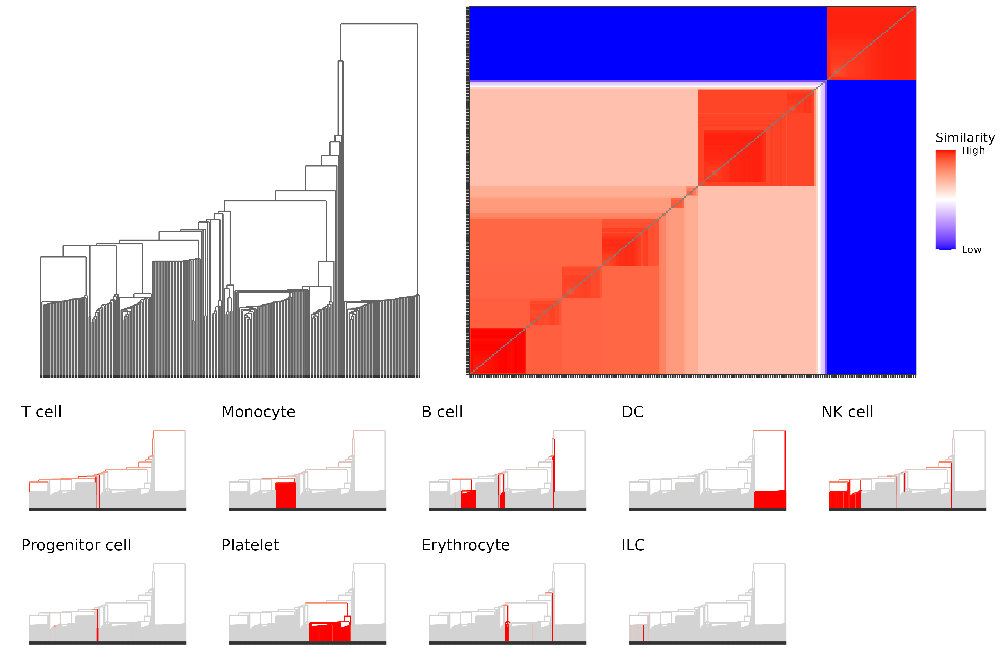
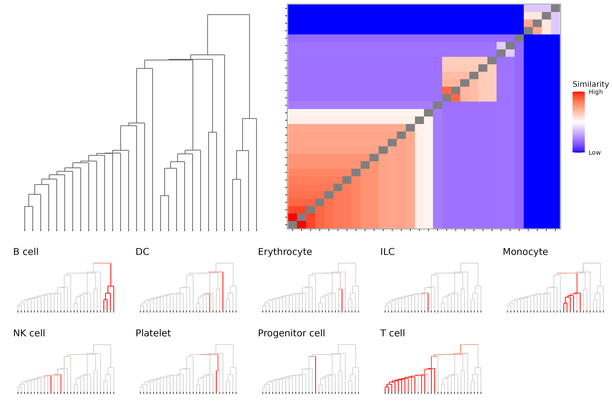

# Human Immune Health Atlas

Data can be [downloaded](https://apps.allenimmunology.org/aifi/resources/imm-health-atlas/downloads/scrna/) from the Human Immune Health Atlas website.

Load the necessary `R` packages and prepare the data

```
library(rhdf5)
library(dplyr)
library(ggplot2)
library(PHM)
library(mclust)
library(ggpubr)

## File location and folders for output
hia_file <- <Downloaded File Location>
mclustDir <- "hiha_mclust"
if (!dir.exists(mclustDir)) dir.create(mclustDir)
leidenDir <- "hiha_leiden"
if (!dir.exists(leidenDir)) dir.create(leidenDir)


## PC Embedding for density estimation
hia_pca <- t(h5read(hia_file, "/obsm/X_pca_harmony"))[, 1:30]

## Cell-type Labels
layer1_map <- h5read(hia_file, "/obs/AIFI_L1/categories")
raw_labels_layer1 <- h5read(hia_file, "/obs/AIFI_L1/codes")
labels_layer1 <- layer1_map[raw_labels_layer1 + 1]
cell_types <- unique(labels_layer1)
```

## Mclust subagging procedure

Perform density estimation and run PHM. Use simplified covariance structures for high dimensional data.

```
mclustParams <- constructPmcParamsSubAggMclust(
  hia_pca, 50, 10000, G=1:100, numCores=10,
  modelNames=c("VII", "VEI", "EII", "VEI"),
  saveDir=mclustDir
)

phm <- PHM(paramsList=mclustParams,
           data=hia_pca,
           mcSamples=1e6,
           batchSize=1e5,
           numCores=10,
           computePosterior = F,
           storeDeltaPmc = F,
           storeParams = F,
           verbose=T)

## Compute the deltaPmc matrix and parameters for the posterior @250 clusters
phm[[250]]$pmc_matrix <- recoverDeltaPmcMatrix(phm, 250)
phm[[250]]$params <- recoverPHMParams(phm, 250)
```

Visualize the results starting from 250 clusters

```
dend <- plotPHMDendrogram(phm[1:250],
                          suppressLabels=T,
                          displayAxis = "none")

htmp <- plotPHMMatrix(phm[1:250],
                      displayAxis = "none",
                      gridColor=grDevices::adjustcolor("black", alpha.f = 0),
                      fillScale = "pmcdist",
                      legendPosition = "right")

### Cell-type specific dendrograms

## Estimate Pr(Cell Type | Cluster) via subsampling
N_SUBSAMP <- 1000
subsamp_res <- lapply(cell_types, function(cls) {
  cls_idx <- which(labels_layer1 == cls)
  n_cls <- length(cls_idx)
  
  if (n_cls < N_SUBSAMP) {
    subsamp_idx <- cls_idx
  } else {
    subsamp_idx <- sample(cls_idx, N_SUBSAMP)
  }
  
  post <- recoverPosterior(
    phm, 250, hia_pca[subsamp_idx, ],
    computePosterior=T
  )
  weight <- n_cls / length(subsamp_idx)
  
  list(mat=post, 
       cls=cls,
       n_cls=n_cls,
       n_subsamp=length(subsamp_idx),
       w=weight)
})

subsamp_labels <- do.call(c,
                          lapply(subsamp_res, function(res) rep(res$cls, res$n_subsamp)))

subsamp_post <- do.call(rbind, 
                        lapply(subsamp_res, function(res) {
                          res$mat * res$w
                        }))

ctype_dendrograms <- lapply(cell_types, function(cls) {
  cls_idx <- which(subsamp_labels == cls)
  group_prob <- colSums(subsamp_post[cls_idx, ]) / colSums(subsamp_post)
  
  plotPHMDendrogram(phm[1:250], 
                    displayAxis="none",
                    suppressLabels = T,
                    groupColorMax = "red",
                    groupProbs = group_prob) + 
    ggtitle(cls)
})

ggarrange(
  ggarrange(dend, htmp, 
            nrow=1, widths=c(4, 5)),
  ggarrange(plotlist=ctype_dendrograms, ncol=5, nrow=2),
  heights=c(3, 2),
  nrow=2
)
```

<center>

</center>


## Leiden subagging procedure

Load the data and perform Leiden cluster in Python using the `scanpy` package.

```
## Ensure packages line up with original analysis
%pip install scanpy==1.9.6
%pip install anndata==0.10.3
%pip install "numpy<2.0"
%pip install leidenalg

import scanpy as sc

h5ad_file = <Downloaded File Location>
adata = sc.read_h5ad(h5ad_file)
sc.tl.leiden(adata)
adata.write_h5ad(<Output File Location>)
```

Filter out singleton clusters from Leiden

```
hia_file <- <Output File Location>

leiden_clust <- h5read(hia_file, "/obs/leiden")$codes + 1
singletons <- names(which(table(leiden_clust) == 1))
invalid_idx <- which(leiden_clust %in% singletons)

labels_layer1_leiden <- labels_layer1[-invalid_idx]
leiden_clust <- leiden_clust[-invalid_idx]
hia_pca_leiden <- hia_pca_filt[-invalid_idx, ]
```

Perform density estimation and run PHM

```
## PHM and Density Estimation
leidenParams <- constructPmcParamsSubAggPartition(
  hia_pca_leiden,
  leiden_clust,
  20,
  5000,
  G=1:20,
  thresold=1e-3,
  numCores=10,
  verbose=T
)

phm <- PHM(paramsList=leidenParams,
           data=hia_pca_leiden,
           mcSamples=1e6,
           batchSize=1e5,
           numCores=10,
           computePosterior = F,
           storeDeltaPmc = F,
           storeParams = F,
           verbose=T)
```

Visualize the results

```
dend <- plotPHMDendrogram(phm,
                          suppressLabels=T,
                          displayAxis = "none")
htmp <- plotPHMMatrix(phm,
                      displayAxis = "none",
                      gridColor=grDevices::adjustcolor("black", alpha.f = 0),
                      fillScale = "pmcdist",
                      legendPosition = "right")


group_prob <- table(labels_layer1_leiden, leiden_clust)
group_prob <- t(group_prob)
group_prob <- group_prob / rowSums(group_prob)
group_prob <- group_prob[sapply(phm[[length(phm)]]$params, function(v) v$class), ]

ctype_dendrograms <- lapply(colnames(group_prob), function(lab) {
  plotPHMDendrogram(phm, 
                    displayAxis = "none",
                    suppressLabels = T,
                    groupColorMax = "red",
                    groupProbs = group_prob[, lab]) +
    ggtitle(lab)
})

ggarrange(
  ggarrange(dend, htmp, 
            nrow=1, widths=c(4, 5)),
  ggarrange(plotlist=ctype_dendrograms, ncol=5, nrow=2),
  heights=c(3, 2),
  nrow=2
)
```

<center>

</center>
