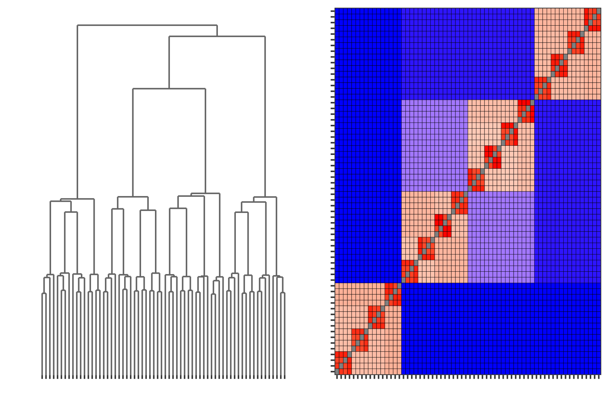

# Nested Diamonds


First, load the necessary packages and data

```
library(PHM)
library(mclust)
library(ggpubr)

data("nested_diamonds", package="PHM")
plot(data)
```

Here we recreate the results for the GMM, using Mclust's model-based hierarchical clustering initialization. Here we consider GMMs using spherical covariances shared across all clusters.

```
mcl_hc <- hc(nested_diamonds, modelName="EII", minclus=1)
mcl <- Mclust(nested_diamonds, G=64, 
              initialization = list(hcPairs=mcl_hc),
              modelNames="EII")
```

Once the density has been estimated, we extract the parameters from the `Mclust` object and run the PHM algorithm

```
mcl_params <- constructPmcParamsMclust(mcl) # takes a minute to run
mcl_phm <- PHM(paramsList=mcl_params, data=nested_diamonds)
```

We can see the

```
mcl_phm_dend <- plotPHMDendrogram(mcl_phm,
                                  suppressLabels = T,
                                  displayAxis="none",
                                  scaleHeights = "log10")

mcl_phm_mat <- plotPHMMatrix(mcl_phm,
                             displayAxis="none", 
                             fillScale = "pmcdist",
                             legendPosition="none")
```

