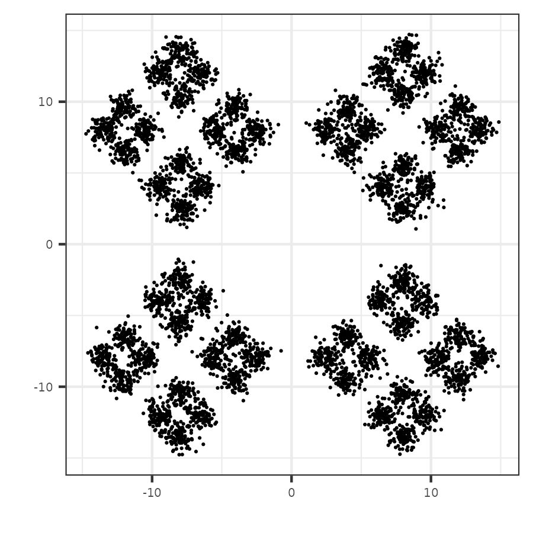
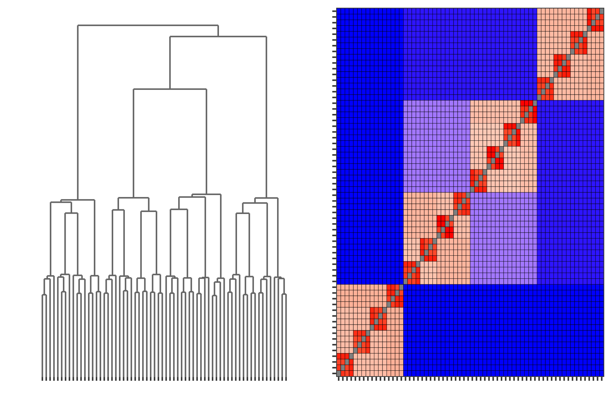

# Nested Diamonds


First, load the necessary packages and data from the `PHM` package

```
library(PHM)
library(mclust)
library(ggpubr)

data("nested_diamonds", package="PHM")
```

The nested diamonds dataset consists of 100 observations drawn from 64 clusters. These clusters are arranged into three layers of structure, as can be seen from the figure below.

- Each of four clusters are arranged along the corners of a diamond ("inner diamonds"), for 16 inner diamonds
- Each of four inner diamonds are arranged along the edges of a larger diamond ("outer diamonds"), for 4 outer diamonds
- The outer diamonds are arranged along the corners of a square


<center>

</center>

Here we recreate the results based on the GMM clustering, using the `Mclust` package's model-based hierarchical clustering initialization. We fit a 64-cluster model with spherical covariances shared across all clusters.

```
mcl_hc <- hc(nested_diamonds, modelName="EII", minclus=1)
mcl <- Mclust(nested_diamonds, G=64, 
              initialization = list(hcPairs=mcl_hc),
              modelNames="EII")
```

Once the density has been estimated (where each component corresponds to a single cluster), we extract the parameters from the `Mclust` object and run the PHM algorithm.

```
mcl_params <- constructPmcParamsMclust(mcl) # takes a minute to run
mcl_phm <- PHM(paramsList=mcl_params, data=nested_diamonds)
```

Visualizing the PHM merging procedure as a heatmap and dendrogram, we clearly see the three layers of structure. The dendrogram has the merging heights group at roughly three levels, signifying the formation of the inner diamonds, the outer diamonds, and the square. We see a similar result in the heatmap, where the dark red regions correspond to the formation of the inner diamonds, the orange regions to the outer diamonds, and the blue regions to the combinations along the edges of the square.

```
mcl_phm_dend <- plotPHMDendrogram(mcl_phm,
                                  suppressLabels = T,
                                  displayAxis="none",
                                  scaleHeights = "log10")

mcl_phm_mat <- plotPHMMatrix(mcl_phm,
                             displayAxis="none", 
                             fillScale = "pmcdist",
                             legendPosition="none")
```

<center>

</center>