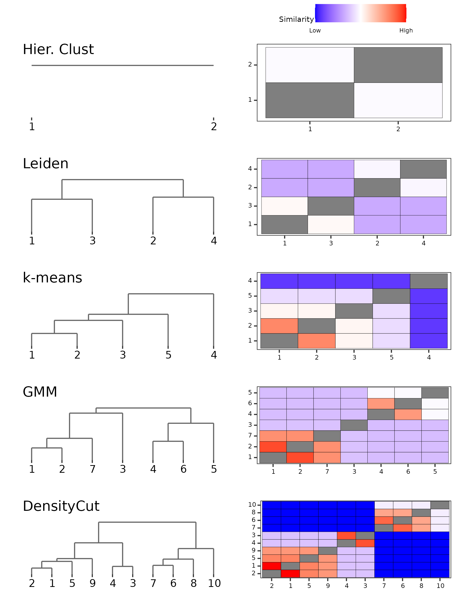

# Peripheral Blood Mononuclear Cells

**Note:** some steps take quite a bit of time (especially the elbow point calculation) so I strongly recommend saving objects if you plan to re-run the analysis.

Load the necessary packages

```
library(PHM)
library(mclust)

library(Seurat)
library(SeuratWrappers)
library(pbmc3k.SeuratData)
library(densitycut)
library(monocle3)
library(ClusterR)

library(dplyr)
library(tidyr)
library(ggplot2)
library(stringr)
library(ggpubr)
```

The data object `pbmc3k.final` can be found in the `pbmc3k.SeuratData` package. Note that the original data computes the first 100 principal components. In order to find the elbow point we compute the first 600 PCs (reduced from the possible 2,800 for computational purposes) and use that to determine the elbow point (which occures at 9 PCs).

```
pbmc3k <- UpdateSeuratObject(pbmc3k.final)
embed <- Embeddings(pbmc3k)
annot <- factor(case_when(
  pbmc3k$seurat_annotations == "Naive CD4 T" ~ "Naive CD4+ T",
  pbmc3k$seurat_annotations == "Memory CD4 T" ~ "Memory CD4+ T",
  pbmc3k$seurat_annotations == "CD8 T" ~ "CD8+ T",
  TRUE ~ pbmc3k$seurat_annotations
),
levels=c("B",
         "Naive CD4+ T", 
         "CD8+ T",
         "Memory CD4+ T", 
         "NK", 
         "CD14+ Mono",
         "DC", "FCGR3A+ Mono",
         "Platelet"))


## Eblow point based on first 900 PCs
tmp <- RunPCA(pbmc3k, features = VariableFeatures(pbmc3k), npcs=600)
tmp_embed <- Embeddings(tmp)
tmp_var <- diag(var(tmp_embed))
pca_dims <- PCAtools::findElbowPoint(tmp_var)

## Can short circuit
# pca_dims <- 9
```

Cluster and run PHM for the different methods

```
## PHM for GMM
set.seed(1)
mcl <- Mclust(embed[, 1:pca_dims], G=1:15)

phm_gmm <- PHM(mclustObj = mcl, 
               computePosterior = T,
               batchSize=1e5)

## PHM for DensityCut
partition_density <- DensityCut(embed[, 1:pca_dims], show.plot=F)$cluster
partition_density <- match(partition_density, sort(unique(partition_density)))

params_density <- constructPmcParamsWeightedPartition(partition_density,
                                                      embed[, 1:pca_dims])
phm_density <- PHM(paramsList = params_density, data=embed[, 1:pca_dims],
                   computePosterior = T,
                   batchSize=1e5)

## PHM for Leiden (via Monocle3)
pbmc3k_cds <- as.cell_data_set(FindNeighbors(pbmc3k, dims = 1:pca_dims))
pbmc3k_cds <- cluster_cells(pbmc3k_cds)
partition_monocle <- as.numeric(clusters(pbmc3k_cds))

params_monocle <- constructPmcParamsWeightedPartition(partition_monocle,
                                                      embed[, 1:pca_dims])
phm_monocle <- PHM(paramsList = params_monocle, 
                   data=embed[, 1:pca_dims],
                   computePosterior = T,
                   batchSize=1e5)

## Silhouette for k-means and hierarchical clustering
hcl <- hclust(dist(embed[, 1:pca_dims]), method="ward.D2")
cluster_silhouettes <- sapply(2:20, function(k) {
  hcl_labels <- cutree(hcl, k)
  kcl_labels <- KMeans_rcpp(embed[, 1:pca_dims], k, num_init = 5)$clusters
  c(K=k,
    sil_hcl=silhouette_of_clusters(embed[, 1:pca_dims], hcl_labels)$silhouette_global_average,
    sil_kcl=silhouette_of_clusters(embed[, 1:pca_dims], kcl_labels)$silhouette_global_average)
})

## Kmeans
kcl_k_sil <- cluster_silhouettes[1, which.max(cluster_silhouettes[3, ])]
kcl_sil <- KMeans_rcpp(embed[, 1:pca_dims], kcl_k_sil, num_init = 5)

partition_kmeans <- kcl_sil$clusters
kcl_sil_params <- constructPmcParamsWeightedPartition(partition_kmeans, embed[, 1:pca_dims])

phm_ksil <- PHM(paramsList=kcl_sil_params, 
                data=embed[, 1:pca_dims], 
                partition=kcl_sil$clusters)

## Hier. Clust
hcl_k_sil <- cluster_silhouettes[1, which.max(cluster_silhouettes[2, ])]
partition_hclust <- cutree(hcl, hcl_k_sil)
hcl_sil_params <- constructPmcParamsWeightedPartition(partition_hclust, embed[, 1:pca_dims])
phm_hsil <- PHM(paramsList=hcl_sil_params, data=embed[, 1:pca_dims], partition=partition_hclust)
```

Set plotting parameters for better visualization

```
plot_theme <- theme(text = element_text(size=7),
                    title = element_text(size=7))

## Get the limits to make sure color scales are roughly the same
delta_pmc <- na.omit(c(
  sapply(phm_gmm, function(x) x$pmc_change),
  sapply(phm_density, function(x) x$pmc_change),
  sapply(phm_monocle, function(x) x$pmc_change),
  sapply(phm_hsil, function(x) x$pmc_change),
  sapply(phm_ksil, function(x) x$pmc_change)
))
plotMax <- max(delta_pmc)
plotMin <- min(delta_pmc)
```

Check the cell-type membership across clusters

```
## Check the cell-type membership across clusters
table(
  annot,
  factor(partition_hclust, levels=c("1", "2"))
)

table(
  annot,
  factor(partition_monocle, levels=c("1", "3", "2", "4"))
)

table(
  annot,
  factor(partition_kmeans, levels=c("1", "2", "3", "5", "4"))
)

table(
  annot,
  factor(mcl$classification, levels=c("1", "2", "7", "3", "4", "6", "5"))
)

table(
  annot,
  factor(partition_density, levels=c("2", "1", "5", "9", "4", "3", "7", "6", "8", "10"))
)
```

Visualize results

```
dendro_gmm <- plotPHMDendrogram(phm_gmm, colorAxis=F,
                                displayAxis="index",
                                scaleHeights = "log10",
                                suppressLabels = T) +
  ggtitle("GMM")


dendro_density <- plotPHMDendrogram(phm_density, colorAxis=F,
                                    displayAxis="label",
                                    scaleHeights = "log10",
                                    suppressLabels = T) +
  ggtitle("DensityCut")


dendro_monocle <- plotPHMDendrogram(phm_monocle, colorAxis=F,
                                    displayAxis="label",
                                    scaleHeights = "log10",
                                    suppressLabels = T) +
  ggtitle("Leiden")

dendro_kmeans <- plotPHMDendrogram(phm_ksil, colorAxis=F,
                                   displayAxis="label",
                                   scaleHeights = "log10",
                                   suppressLabels = T) +
  ggtitle("k-means")

dendro_hclust <- plotPHMDendrogram(phm_hsil, colorAxis=F,
                                   displayAxis="label",
                                   scaleHeights = "log10",
                                   suppressLabels = T) +
  ggtitle("Hier. Clust")


## PHM Merging Matrices
matrix_gmm <- plotPHMMatrix(phm_gmm, colorAxis = F,
                            fillScale = "pmcdist",
                            displayAxisSize = 6,
                            fillLimits = c(plotMin, plotMax),
                            displayAxis = "index")

matrix_density <- plotPHMMatrix(phm_density, colorAxis=F,
                                fillScale = "pmcdist",
                                fillLimits = c(plotMin, plotMax),
                                displayAxisSize = 6,
                                displayAxis = "label")

matrix_monocle <- plotPHMMatrix(phm_monocle, colorAxis=F,
                                fillScale = "pmcdist",
                                fillLimits = c(plotMin, plotMax),
                                displayAxisSize = 6,
                                displayAxis = "label")

matrix_kmeans <- plotPHMMatrix(phm_ksil, colorAxis=F,
                               fillScale = "pmcdist",
                               fillLimits = c(plotMin, plotMax),
                               displayAxisSize = 6,
                               displayAxis = "label")

matrix_hclust <- plotPHMMatrix(phm_hsil, colorAxis=F,
                               fillScale = "pmcdist",
                               fillLimits = c(plotMin, plotMax),
                               displayAxisSize = 6,
                               displayAxis = "label")


ggarrange(
  NULL,
  get_legend(matrix_gmm + plot_theme, "top"),
  dendro_hclust,
  matrix_hclust,
  dendro_monocle,
  matrix_monocle,
  dendro_kmeans,
  matrix_kmeans,
  dendro_gmm,
  matrix_gmm,
  dendro_density,
  matrix_density,
  ncol=2,
  nrow=6,
  heights=c(1, 3, 3, 3, 3, 3),
  widths=c(3, 3)
)
```

<center>

</center>
