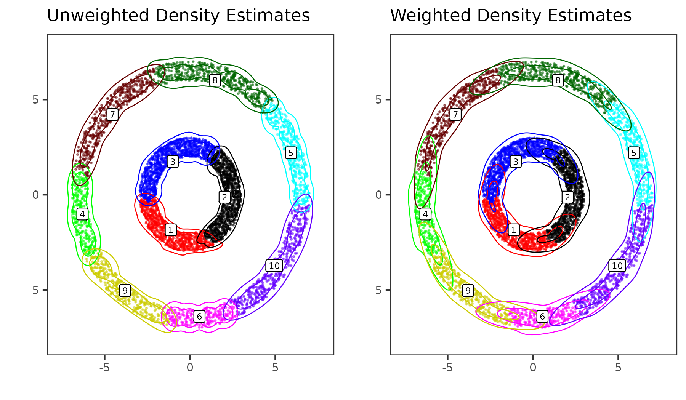

# Weighted Density Estimation

First, load the necessary `R` packages
```
library(PHM)
library(mclust)
library(ppclust)
library(RColorBrewer)
library(ggplot2)
library(ggpubr)
```

In the below examples we compare two approaches for cluster-specific density estimation based on a partition.  

1. *Unweighted*: Use only the observations in a given cluster to estimate its cluster-specific density
2. *Weighted*: Each observation is assigned a cluster-specific weight based on its distance to a given cluster. Specifically, the "distance" for an observation $i$ to a given cluster $k$ is defined as

$$
    d_{x_i \mapsto C_k} = \min_{j \in C_k} d(x_i, x_j)
$$

which is the smallest distance to any point in that cluster (we use the Euclidean distance for $d(\cdot, cdot)$). Note that if $i \in C_k$ then $d_{x_i \mapsto C_k} = 0$. The weight for observation $i$ to cluster $k$ is

$$
    w_{ik} = \frac{e^{-d_{x_k \mapsto C_k}}}{ \sum_{l=1}^K e^{-d_{x_i \mapsto C_l}} }
$$

The unweighted scheme is a special case of the weighted scheme where $w_{ik} = 1$ if $i \in C_k$ and 0 otherwise. There are other options for specifying $d_{x_i \mapsto C_k}$, such as the average distance between that and all points in the cluster. Fuzzy clustering methods such as $C$-means produce these uncertainty measurements as part of the estimation procedure.

Practically, the weighting is a way to incorporate uncertainty in the cluster assignments into the density estimation procedure which would otherwise be lost if solely considering cluster membership. For the purpose of recovering true underlying densities, we show that the weighted scheme is better than the naive unweighted scheme in the example below.

## 1D Gaussians Example

We consider 500 observations drawn from two Gaussian distributions with unit variance. One Gaussian is centered at 0 while the other is centered at $\mu = 2$. We use $k$-means to produce a partition of two clusters on this data, and estimate the cluster-specific densities in both the unweighted and weighted manners described above. We also fit a $c$-means solution, which estimates the weights as part of the clustering procedure, and use its estimated weights to estimate the cluster-specific density (the $k$-means and $c$-means partitions are nearly identical in this case). In all cases, we use a single Gaussian to estimate the density for each cluster.

```
mu <- 2
N <- 500
set.seed(1)
dat <- rnorm(N) + rep(c(0, 2), N/2)

kcl <- kmeans(dat, 2)
clust <- kcl$cluster

fcl <- fcm(dat, centers=2)
fcl_weights <- fcl$u
fcl_clust <- fcl$cluster

params_u <- constructPmcParamsPartition(clust, dat, G=1)
params_w <- constructPmcParamsWeightedPartition(clust, dat, G=1)
params_f <- constructPmcParamsWeightedPartition(fcl_clust, dat, weights=fcl_weights, G=1)
```

In the plots below, the dashed lines correspond to the underlying cluster densities, while the solid red and blue lines are the estimated densities from each procedure. Looking to the unweighted density scheme, it tends to under-estimate the density in the tails of the distribution which understates the overlap between the clusters. The default weighting scheme tends to over-estimate the weights in the tails of the distributions. Finally, the density based on the $c$-means weights very closely matches the original clustering solution.

<center>

</center>


In terms of the estimated $P_{\rm mc}$ between the clusters, in this case the unweighted scheme under-estimates $P_{\rm mc} = 0.11$, the default weighting scheme somewhat over-estimates $P_{\rm mc} = 0.3$, while the $c$-means weights get an accurate estimate of $P_{\rm mc} = 0.23$. 

```
Truth   Unweighted   Weighted   Cmeans 
0.225        0.109      0.300    0.226 
```

## Double Rings Example

Here we illustrate the differences in the naive and weighted density estimates for a slightly more complex example. We use the `double_ring` simulated data from [Turfah and Wen, 2025]() and consider the hierarchical clustering solution for $k = 10$. We visualize the partition of the data below.

```
## Start from hierarchical clustering partition with k = 10
data("double_ring", package = "PHM")
hcl <- hclust(dist(double_ring), method = "ward.D2")
hcl_labels <- cutree(hcl, 10)
```

<center>

</center>

We use both the unweighted and weighted density estimation schemes to obtain cluster-specific density estimates. These densities are then uesd to compute $P_{\rm mc}$ of the given cluster density configurations. 

```
hcl_unweight_dens <- constructPmcParamsPartition(hcl_labels, double_ring)
hcl_weighted_dens <- constructPmcParamsWeightedPartition(hcl_labels, double_ring)

unweight_pmc <- computeMonteCarloPmc(hcl_unweight_dens)
weighted_pmc <- computeMonteCarloPmc(hcl_weighted_dens)
```


Below are the estimated cluster-specific densities, as well as the estimated $P_{\rm mc}$ values for each set of density estimates. We see that the value of $P_{mc}$ is significantly higher for the weighted density estimate that it is for the unweighted density.

<center>

</center>

